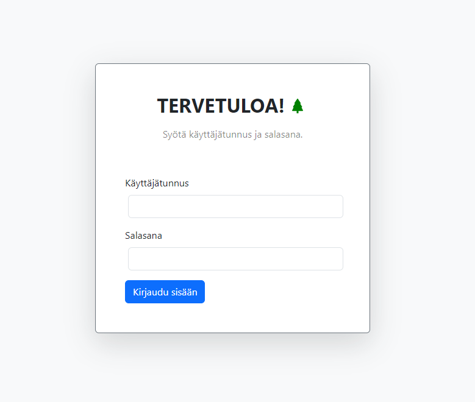
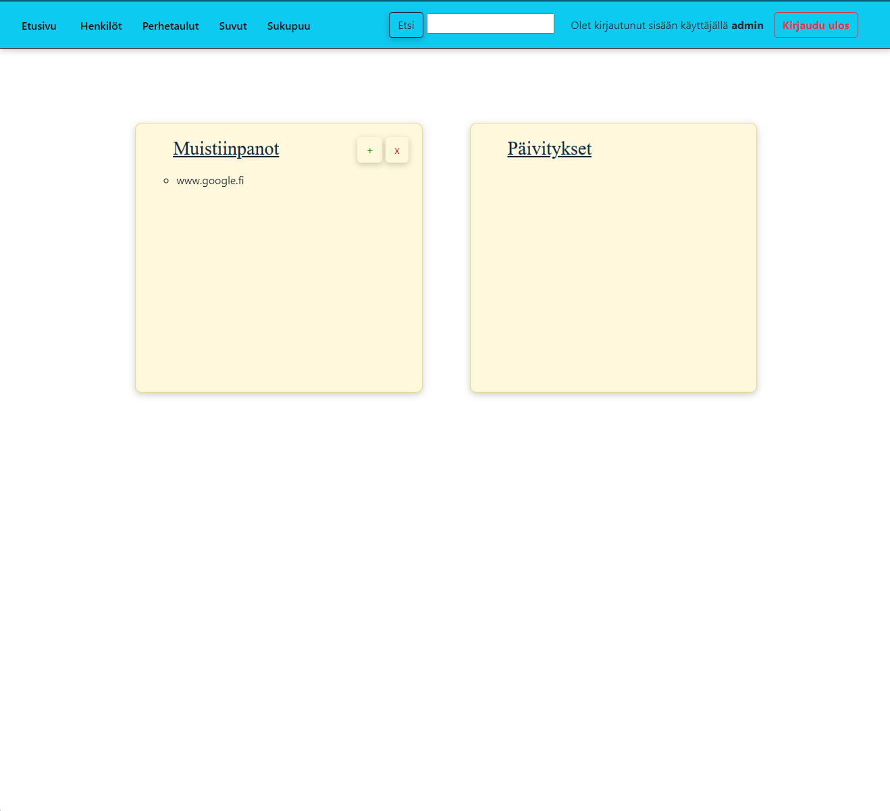
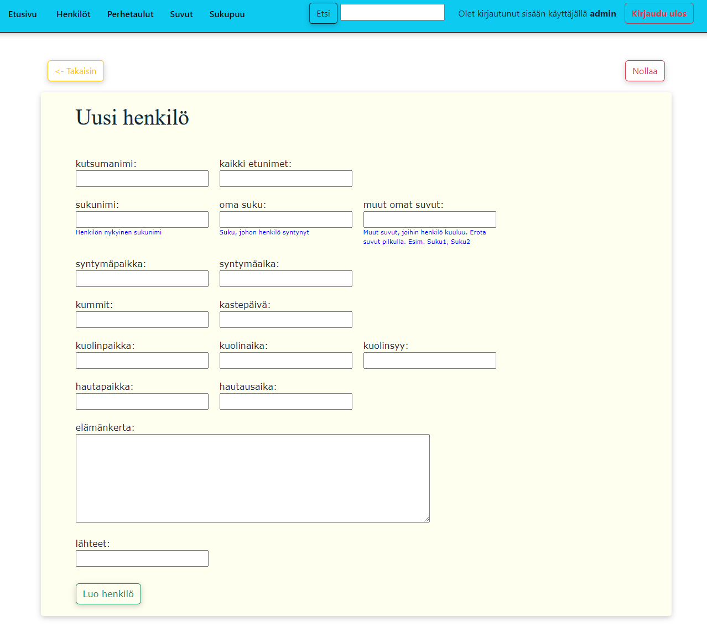
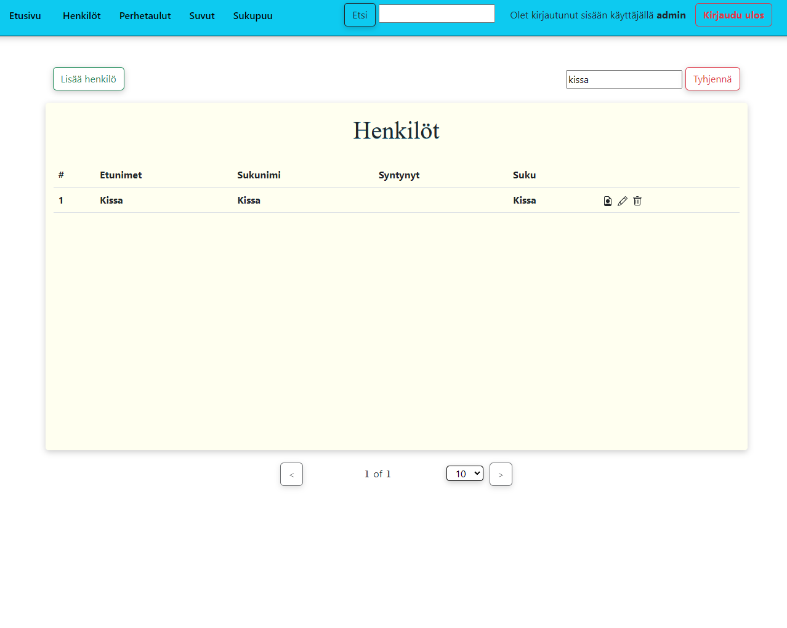
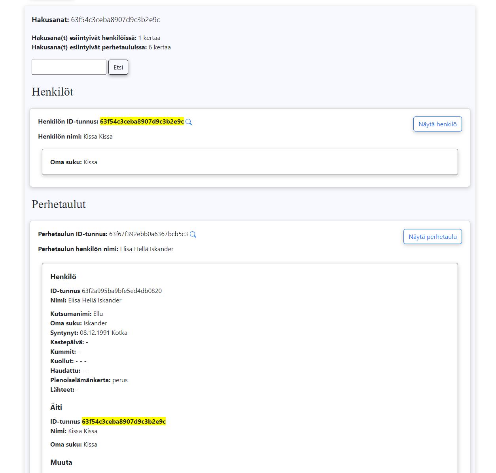
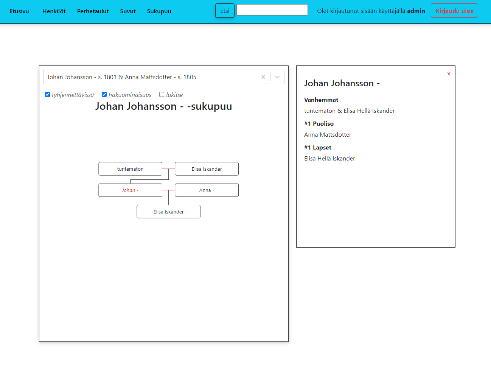

# FamilyTreeApp

In progress... The code will still change, optimize, and everything in between. :)

### About

The application uses ReactJS in the frontend, NodeJS in the backend, and MongoDB as the database.

Features of the family tree application include:

- Log in and log out
- Ability to add, delete and/or edit a note, person, and/or family chart
- View a person either through different lists or via the family tree chart
- Search for individuals, family charts, words using keywords
- Filtering of person lists and family charts
- In the family tree chart, you can click on an individual to view their details.
- For now, a user can be added by slightly modifying the code and using, for example, Postman.

### Project Setup

```sh
npm install
```

You need to create a .env file in the root of the backend folder, which contains:

- MONGODB_URI
- PORT
- SECRET

### Compile and Hot-Reload for Development

```sh
npm run start
```

```sh
npm run dev
```

### Compile and Minify for Production

```sh
npm run build
```

### Images

Some images of the application. Note! The images contain fictional data.







